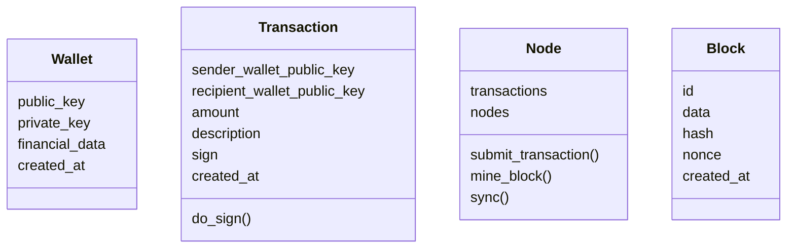

<!-- TODO check typos -->
<!-- COMPLETE:
#### Video Demo:  <URL HERE>
<present your project to the world, as with slides, screenshots, voiceover, and/or live action. Your video should somehow include your project’s title, your name, your city and country, and any other details that you’d like to convey to viewers>

#### Description:
<several hundred words that describe things in detail>
<explain what your project is, what each of the files you wrote for the project contains and does, and if you debated certain design choices, explaining why you made them>
<If it is too short, the system will reject it>
https://github.com/ikatyang/emoji-cheat-sheet/blob/master/README.md
-->

# This is CS50chain

Blockchain POC to CS50 final project

<details open>
  <summary>contents</summary>
  <ol>
    <li><a href="#description">description</a></li>
    <li><a href="#entities">entities</a></li>
    <li><a href="#api">api</a></li>
    <li><a href="#usage">usage</a></li>
    <li><a href="#acknowledgments">acknowledgments</a></li>
    <li><a href="#roadmap">roadmap</a></li>
    <li><a href="#license">license</a></li>
  </ol>
</details>

## description

Blockchain is a decentralized way to save data. In our case, as bitcoin works, the data is financial transactions.
First is necessary the user to create their wallet that's is a pair of RSA256 keys. These will work as address to receive deposits and authenticate withdraws.
The API in itself is an abstraction to a Node, it is a piece of the network that decentralize the blockchain. It is responsible for submitting transactions to block and mine them.
Mine means doing a proof of work calculation and being responsible for sending the new block to the blockchain.

## entities


<!--
<table>
  <thead>
    <tr>
      <th width="20%">Wallet</th>
      <th width="20%">Transaction</th>
      <th width="20%">Block</th>
      <th width="20%">Node</th>
    </tr>
  </thead>
  <tbody>
    <tr>
      <td><ul><li>public_key<li>private_key<li>created_at</td>
      <td><ul><li>sender_wallet_public_key<li>recipient_wallet_public_key<li>amount<li>description<li>sign<li>created_at</td>
      <td><ul><li>id<li>data<li>hash<li>nonce<li>created_at</td>
      <td><ul><li>transactions<li>url</td>
    </tr>
  </tbody>
</table>
-->

## api

- GET /api/node
  - get current node transactions and other node addresses
- POST /api/node/address
  - add new node address
- DELETE /api/node/transactions
  - clear node transactions
- POST /api/node/mine
  - mine block, aka sync transaction with other nodes, calculate nonce (proof of work), and create a new block to the blockchain
- GET /api/chain
  - get blockchain
- POST /api/chain
  - sync current node with other blockchain and transactions
- POST /api/wallet
  - create new wallet
- POST /api/search/wallet
  - get wallet search
- POST /api/transaction
  - submit transaction to node

## usage
<!-- IMPROVE add `Dockerfile`, `make docker-build` and use build on `make docker-run` and `make docker-test` -->

To run the node locally run `make docker-run` and then open on browser http://localhost:5000/ to interact with an interface.
To run another node to mock transactions and sync between them, use `make docker-run APP_NAME=cs50chain-clone PORT=5001` and open http://localhost:5001/ .

To run tests `make docker-test`.

Results at **Jun 6 2022**
```txt
Coverage report: 90%
coverage.py v6.4.1, created at 2022-06-12 01:02 +0000
```

_Module_|_statements_|_missing_|_excluded_|_coverage_
-|-|-|-|-
app/block.py|64|10|0|84%
app/config.py|7|0|0|100%
app/node.py|80|17|0|79%
app/transaction.py|55|9|0|84%
app/wallet.py|54|1|0|98%
test/test_app.py|117|1|0|99%
**Total**|**377**|**38**|**0**|**90%**

## acknowledgments
<!-- TODO send coments to this articles saying they were importante to this project-->

- [A Practical Introduction to Blockchain with Python](http://adilmoujahid.com/posts/2018/03/intro-blockchain-bitcoin-python/)
- [On the Origins and Variations of Blockchain Technologies](https://arxiv.org/abs/1810.06130)
- [Bitcoin Whitepaper](https://bitcoin.org/bitcoin.pdf)
- [TypeScript Blockchain](https://github.com/khaosdoctor/typescript-blockchain)
- [Code your own blockchain in less than 200 lines of Go!](https://mycoralhealth.medium.com/code-your-own-blockchain-in-less-than-200-lines-of-go-e296282bcffc)
- [Learn Blockchains by Building One](https://medium.com/@vanflymen/learn-blockchains-by-building-one-117428612f46)
- [Best-README-Template](https://github.com/othneildrew/Best-README-Template)

## roadmap
<!-- IMPROVE -->

- frontend
  - [ ] add copy to clipboard button on table lines and copy object
  - [ ] clickable link to expand with complete object
- documentation
  - [ ] add swagger
  - [ ] codeclimate
- online
  - [ ] deploy app
  - [ ] save blockchain on heroku postgresql

## license

[MIT](https://github.com/victorabarros/CS50chain/blob/main/LICENSE)
