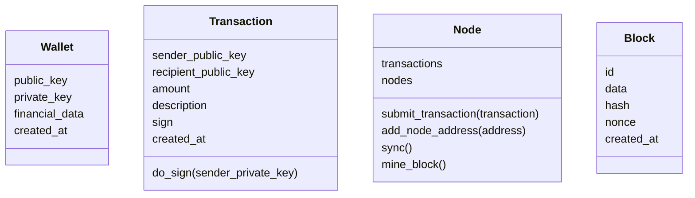

# This is CS50chain

Blockchain POC to [CS50 final project](https://cs50.harvard.edu/x/2022/project/)

<details open>
  <summary>content</summary>
  <ol>
    <li><a href="#description">description</a></li>
    <li><a href="#entities">entities</a></li>
    <li><a href="#api">api</a></li>
    <li><a href="#usage">usage</a></li>
    <li><a href="#acknowledgments">acknowledgments</a></li>
    <li><a href="#roadmap">roadmap</a></li>
    <li><a href="#license">license</a></li>
  </ol>
</details>

## description

Blockchain is a decentralized way to save data. In our case, as bitcoin works, the data is financial transactions.
First is necessary for the user to create their wallet that's is a pair of RSA256 keys. These will work as address to receive deposits and authenticate withdraws.
The API in itself is an abstraction to a Node, it is a piece of the network that decentralize the blockchain, it is responsible for submitting transactions to block and mine them.
Mine means doing a proof of work calculation and being responsible for sending the new block to the blockchain.

## entities



## api

- GET /api/node
  - get current node transactions and other node addresses
- POST /api/node/address
  - add new node address
- DELETE /api/node/transactions
  - clear node transactions
- POST /api/node/mine
  - mine block, aka sync transaction with other nodes, calculate nonce (proof of work), and create a new block to the blockchain
- GET /api/chain
  - get blockchain
- POST /api/chain
  - sync current node with other blockchain and transactions
- POST /api/wallet
  - create new wallet
- POST /api/search/wallet
  - wallet search
- POST /api/transaction
  - submit transaction to node

## usage

To run the node locally run `make docker-run` and then open on browser <http://localhost:5000/> to interact with an interface.
To run another node to mock transactions and sync between them, use `make docker-run APP_NAME=cs50chain-clone PORT=5001` and open <http://localhost:5001/> .

To run tests `make docker-test`. Following results:

```sh
Jun 14 2022
Name                 Stmts   Miss  Cover
----------------------------------------
app/__init__.py          0      0   100%
app/block.py            85     15    82%
app/config.py            8      0   100%
app/database.py         15      1    93%
app/node.py             79     18    77%
app/transaction.py      55      9    84%
app/wallet.py           58      1    98%
test/__init__.py         0      0   100%
test/test_app.py       107      0   100%
----------------------------------------
TOTAL                  407     44    89%
```

If you want to persist data, run `make docker-migration` and it'll create a local sqlite3 database. These commands can be used to run sql queries on the database.

## acknowledgments
<!-- TODO send coments to this articles saying they were importante to this project-->

- [A Practical Introduction to Blockchain with Python](http://adilmoujahid.com/posts/2018/03/intro-blockchain-bitcoin-python/)
- [On the Origins and Variations of Blockchain Technologies](https://arxiv.org/abs/1810.06130)
- [Bitcoin Whitepaper](https://bitcoin.org/bitcoin.pdf)
- [TypeScript Blockchain](https://github.com/khaosdoctor/typescript-blockchain)
- [Code your own blockchain in less than 200 lines of Go!](https://mycoralhealth.medium.com/code-your-own-blockchain-in-less-than-200-lines-of-go-e296282bcffc)
- [Learn Blockchains by Building One](https://medium.com/@vanflymen/learn-blockchains-by-building-one-117428612f46)
- [Best-README-Template](https://github.com/othneildrew/Best-README-Template)

## roadmap
<!-- IMPROVE -->

- infra
  - [ ] add `Dockerfile`, `make docker-build` and use build on `make docker-run` and `make docker-test`
- frontend
  - [ ] add copy to clipboard button on table lines and copy object
  - [ ] clickable link to expand with complete object
- documentation
  - [ ] add swagger
  - [ ] codeclimate
- online
  - [ ] deploy app
  - [ ] save blockchain on heroku postgresql

## license

[MIT](https://github.com/victorabarros/CS50chain/blob/main/LICENSE)
