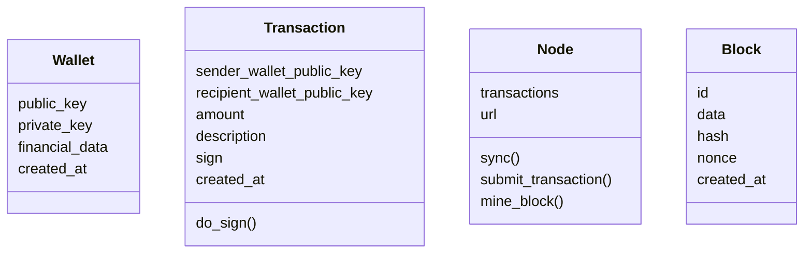

<!--
## todo

- sync
- sync transactions and chain with other nodes

#### Video Demo:  <URL HERE>
<present your project to the world, as with slides, screenshots, voiceover, and/or live action. Your video should somehow include your project’s title, your name, your city and country, and any other details that you’d like to convey to viewers>

#### Description:
<several hundred words that describe things in detail>
<explain what your project is, what each of the files you wrote for the project contains and does, and if you debated certain design choices, explaining why you made them>
<If it is too short, the system will reject it>
https://github.com/ikatyang/emoji-cheat-sheet/blob/master/README.md
-->

<!--
## concepts
Blockchain > _blockchain is a distributed database that allows direct transactions between two parties without the need of a central authority_
Hash > it's one side only algo. must popular is SHA256
Public Key Cryptography > authentication, where the public key verifies a holder of the paired. must popular RSA
JWT
Consensus > ""
## host
- https://pages.github.com/
- https://www.heroku.com/
-->

# CS50chain

Blockchain POC to CS50 final project

## description

Blockchain is a decentralized way to save data. In our case, as bitcoin works, the data is financial transactions.
First is necessary the user to create their wallet that's is a pair of RSA256 keys. These will work as address to receive deposits and authenticate withdraws.
The API in itself is an abstraction to a Node, it is a piece of the network that decentralize the blockchain. It is responsible for submitting transactions to block and mine them.
Mine means doing a proof of work calculation and being responsible to send the new block to the blockchain.

## entities

<!--
<table>
  <thead>
    <tr>
      <th width="20%">Wallet</th>
      <th width="20%">Transaction</th>
      <th width="20%">Block</th>
      <th width="20%">Node</th>
    </tr>
  </thead>
  <tbody>
    <tr>
      <td><ul><li>public_key<li>private_key<li>created_at</td>
      <td><ul><li>sender_wallet_public_key<li>recipient_wallet_public_key<li>amount<li>description<li>sign<li>created_at</td>
      <td><ul><li>id<li>data<li>hash<li>nonce<li>created_at</td>
      <td><ul><li>transactions<li>url</td>
    </tr>
  </tbody>
</table>
-->

## api

- POST /api/wallet {}
- POST /api/search/wallet {public_key:public_key} -> {pub_key, balance, statement}
- GET  /api/node -> current transactions
- GET  /api/chain -> [block]
- POST /api/node/mine
- POST /api/transaction {Transaction signed}

## commands

`make docker-debug`
`make docker-test`

## references

http://adilmoujahid.com/posts/2018/03/intro-blockchain-bitcoin-python/
https://github.com/adilmoujahid/blockchain-python-tutorial/
https://arxiv.org/abs/1810.06130
https://bitcoin.org/bitcoin.pdf
https://github.com/khaosdoctor/typescript-blockchain
https://mycoralhealth.medium.com/code-your-own-blockchain-in-less-than-200-lines-of-go-e296282bcffc
https://medium.com/@vanflymen/learn-blockchains-by-building-one-117428612f46

## next steps
<!-- IMPROVE -->

- frontend
  - add copy to clipboard button on table lines and copy object
  - clicable line to expand with complete object
- swagger
- DB
  - heroku sql
